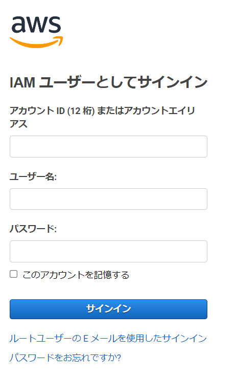
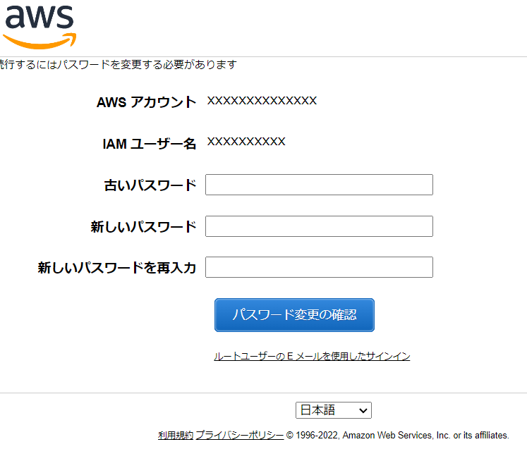
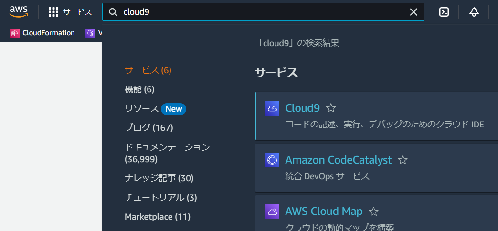

# 研修生向けマニュアル トップページ

## Crandim Developer Trainingとは

Crandim Developer Training（以下CDTと略します）は、株式会社クランディムの新入社員が、プログラミングの研修を行うためのプログラミング演習環境です。以下、`CDT`と略します。

CDTは、以下のようなサービス、ソフトウェアを利用して構築されています。

```
        ┌───────┐
        │  CDT  │
      ┌─┴───────┴─┐
      │ Java/JDK  │
    ┌─┴───────────┴─┐
    │   AWS Cloud9  │
┌───┴───────────────┴───┐
│ Amazon Web Services   │
│         (AWS)         │
└───────────────────────┘
```

CDTを使用するには、 株式会社クランディム研修担当者が発行する、CDT用の`IAM認証情報`が必要です。

CDT用の`IAM認証情報`は、主に株式会社クランディムの新入社員、内定者に発行されます。詳細については、株式会社クランディム研修担当者にお問い合わせください。

`IAM認証情報`は、`アカウントID`、`ユーザー名`、`パスワード`の3つの情報からなります。

* `アカウントID` : CDTを使用するためのAWSアカウントのIDです。`アカウントID`は、`IAM認証情報`を発行する際に、研修担当者が指定します。
* `ユーザー名` ：受講生ごとに異なります。
* `パスワード` ：受講生ごとに異なります。

## ログインする

CDTを使用するには、CDT用の`IAM認証情報`を使用して、`AWSのコンソール`にログインする必要があります。

:::note info
`AWSのコンソール`とは、`Amazon`社が提供する`Amazon Web Services`というクラウドサービスの設定画面です。
:::

CDT用の`IAM認証情報`を、`Amazon Web Services Sign-in`画面（ [`https://console.aws.amazon.com/console/home`](https://console.aws.amazon.com/console/home) ）で入力します。



* `アカウント ID (12 桁) またはアカウントエイリアス` : 通常は入力済みです。入力されていない場合は、株式会社クランディム研修担当者から発行された`IAM認証情報`の`アカウントID`を入力してください
* `ユーザー名` ： 株式会社クランディム研修担当者から発行された`IAM認証情報`の`ユーザー名`を入力してください
* `パスワード` ： 株式会社クランディム研修担当者から発行された`IAM認証情報`の`パスワード`を入力してください
* `このアカウントを記憶する` : チェックを入れておくと、次回から入力を省略することができます。
* 最後に`サインイン`ボタンをクリックしてください。

## パスワードを設定する

初回ログイン時には、`パスワード`を再設定する必要があります。

初めてログインすると、以下のような画面が表示されます。



* `古いパスワード`
  * `IAM認証情報`の`パスワード`を入力してください。
* `新しいパスワード`
  * `IAM認証情報`の`パスワード`とは異なるパスワードを入力してください。
  * ただし、アルファベット大文字、小文字、数字、記号のすべてを含む8文字以上のパスワードを設定してください。
* `新しいパスワードを再入力`
  * `新しいパスワード`と同じパスワードを入力してください。
* 最後に`パスワード変更の確認`ボタンをクリックして、パスワード変更を完了してください。

パスワード設定が成功すると、画面の右上に`(自分のユーザ名) @ xxxxxx `と表示されます。※`xxxxxx`部分は`アカウントID`。

これ以降は、上記で入力した新しいパスワードを使用してログインしてください。

## CDTの画面を開く

ログインが成功した状態で、画面上部にある`検索`ボックスに、`Cloud9`と入力すると、サービス一覧に`Cloud9`が表示される（下画像）ので、リンクをクリックします。 または、下記リンクを開きます。
* [`https://us-east-1.console.aws.amazon.com/cloud9control/home?region=us-east-1#/`](https://us-east-1.console.aws.amazon.com/cloud9control/home?region=us-east-1#/)



一覧画面（下画像）が表示されるので、`Name`列に自分のユーザIDが入っている項目の`Open`リンクをクリックします。


成功すると、`Cloud9`の画面が表示されます。

## 次のステップ

次のステップ [Cloud9の使い方](./cloud9/) で、Cloud9の基本次項について説明します。